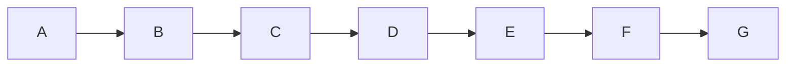

# 线性表
## 定义：有限&有序序列；除首尾元素外，均有且仅有一个前驱&一个后继

```mermaid
graph LR
A --> B --> C --> D --> E --> F --> G
```
## 顺序存储
    地址连续的存储单元一次存储线性表中的数据元素
[ADT-Python](./Linear_sequence_ADT.py)
[ADT-Go](./Linear_sequence_ADT.go)
## 链式存储