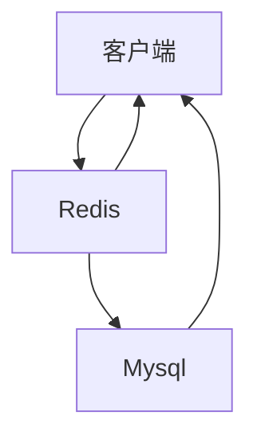
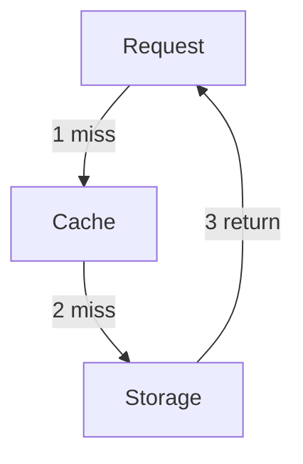
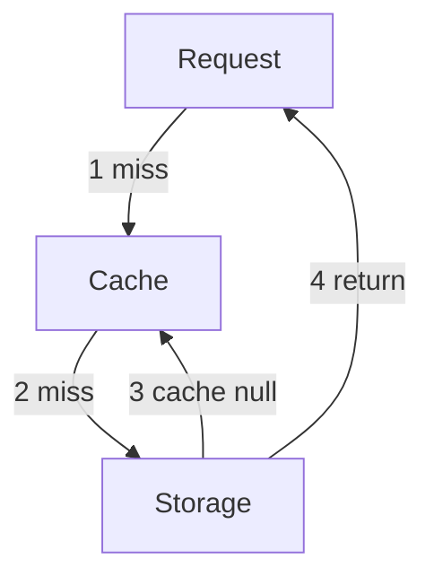
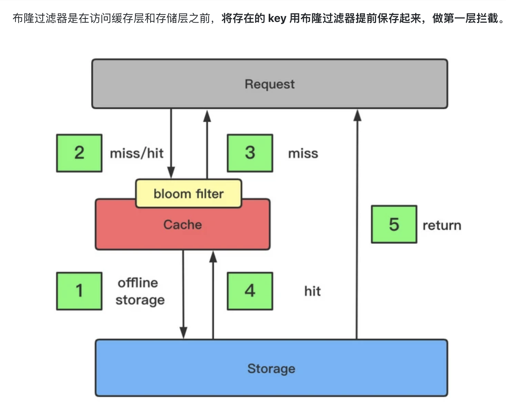

<!-- @import "[TOC]" {cmd="toc" depthFrom=1 depthTo=6 orderedList=false} -->

<!-- code_chunk_output -->

- [收益 & 成本](#收益--成本)
  - [收益](#收益)
  - [成本](#成本)
- [场景](#场景)
- [缓存更新策略](#缓存更新策略)
  - [1. LRU、LFU、FIFO etc算法剔除](#1-lrulfufifo-etc算法剔除)
  - [2. 超时剔除](#2-超时剔除)
  - [3. 主动更新](#3-主动更新)
- [粒度控制](#粒度控制)
  - [常用架构：缓存层 -> Redis, 存储层 -> Mysql](#常用架构缓存层---redis-存储层---mysql)
  - [说明](#说明)
    - [1、通用性](#1通用性)
    - [2、空间占用](#2空间占用)
    - [3、代码维护](#3代码维护)
- [面试常考](#面试常考)
  - [缓存穿透](#缓存穿透)
    - [优化方案：](#优化方案)
      - [1、缓存空对象](#1缓存空对象)
      - [2、布隆过滤器](#2布隆过滤器)
  - [缓存雪崩](#缓存雪崩)
  - [无底洞问题](#无底洞问题)
  - [热点Key的重建优化](#热点key的重建优化)

<!-- /code_chunk_output -->

# 收益 & 成本
## 收益
1. 加速读写：CPU L1、L2、L3 cache；浏览器缓存
2. 降低后端负载：帮助后端减少访问量和复杂计算
## 成本
1. 数据不一致：缓存层和数据层有时间窗口不一致
2. 代码维护成本：加入缓存后需要同时处理缓存层和存储层的逻辑，增大维护成本
3. 运维成本：redis cluster等等的运维成本
# 场景
1. 降低后端负载：高消耗的SQL：join结果集/分组统计结果缓存
2. 加速请求响应：利用redis、memcache优化IO响应时间
3. 大量写合并为批量写：计数器先redis累加再批量写入DB
# 缓存更新策略
    缓存中的数据都是有生命周期的，需要在某短时间后被淘汰或更新，保障业务的同时保证缓存空间占用可控。
    
    缓存中的数据会和数据源中的真实数据有一段时间窗口的不一致，需要使用某些策略更新。

## 1. LRU、LFU、FIFO etc算法剔除
a. LRU：(Least Recently Used), 最近最少使用
b. LFU：(Least Frequently Used), 最不经常使用
c. FIFO：(First In First Out), 先进先出

使用场景：
一致性：
维护成本：
## 2. 超时剔除
使用场景：给缓存数据设置过期时间，让其在过期时间后自动删除。适用于业务可以容忍一段时间内，缓存层数据和真实数据源的数据不一致。设置过期时间，超时后再从真实数据源获取数据，重新放入缓存并设置过期时间。

一致性：
维护成本：
## 3. 主动更新
使用场景：业务对于数据的一致性要求高，需要在真实数据更新后，立即更新缓存数据。可以利用消息系统或其他方式通知缓存更新。
一致性：一致性最高，如果主动更新发生问题，可能长时间不被更新，最好结合超时剔除一起使用。
维护成本：维护成本较高
# 粒度控制
## 常用架构：缓存层 -> Redis, 存储层 -> Mysql

缓存用户信息为例：
1. 从Mysql查询，得到结果
2. 放入缓存
   
粒度：所有列or重要列
## 说明
### 1、通用性
全部数据更通用，但一般来说很长一段时间内应用只需要几个重要字段
### 2、空间占用
缓存全部数据占用更多空间

    全部数据造成内存的浪费
    全部数据可能导致每次传输产生的网络流量较大，耗时相对较大，极端情况下会阻塞网络
    全部数据的序列化&反序列化的CPU计算开销大
### 3、代码维护
全部数据优势明显，部分数据一旦要加新字段要修改业务代码，修改后通常还需要刷新缓存数据。
# 面试常考
## 缓存穿透
查询一个根本不存在的数据，缓存层和存储层都不会命中。通常情况下，出于容错考虑，如果从存储层查不到数据则不写入缓存层。

1. 缓存层不命中
2. 存储层不命中，不将空结果写回缓存
3. 返回空结果

缓存穿透带来的问题：1. 失去缓存保护后端存储的意义 2. 导致后端存储负载加大

发现：总调用数、存储层命中数、缓存层命中数，如果发现大量存储层空命中，可能出现了缓存穿透问题。

### 优化方案：
#### 1、缓存空对象

#### 2、布隆过滤器

## 缓存雪崩
由于Cache服务承载大量的请求，当Cache服务宕机后，大量的流量会直接压向后端组件DB，造成级联故障。

    保证缓存高可用性
    依赖隔离组件为后端限流降级

## 无底洞问题
TODO: https://segmentfault.com/a/1190000038775956
## 热点Key的重建优化