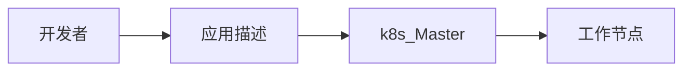
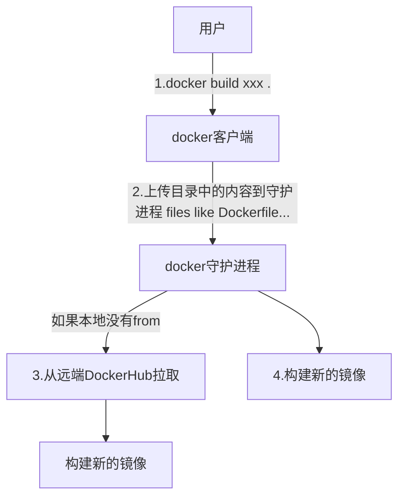

<!-- @import "[TOC]" {cmd="toc" depthFrom=1 depthTo=6 orderedList=false} -->

<!-- code_chunk_output -->

- [基础](#基础)
  - [kubernetes：](#kubernetes)
  - [特点](#特点)
  - [为什么](#为什么)
  - [能做什么](#能做什么)
- [概念](#概念)
  - [组件](#组件)
    - [1. Master组件](#1-master组件)
      - [01 kube-apiserver](#01-kube-apiserver)
      - [02 ETCD](#02-etcd)
      - [03 kube-controller-manager](#03-kube-controller-manager)
      - [01 kube-apiserver](#01-kube-apiserver-1)
      - [02 ETCD](#02-etcd-1)
      - [03 kube-controller-manager](#03-kube-controller-manager-1)
      - [04 cloud-controller-manager](#04-cloud-controller-manager)
      - [05 kube-scheduler](#05-kube-scheduler)
      - [06 addons](#06-addons)
      - [07 DNS](#07-dns)
      - [08 用户界面](#08-用户界面)
      - [09 容器资源监测](#09-容器资源监测)
      - [10 Cluster-level Logging](#10-cluster-level-logging)
    - [2. Node组件](#2-node组件)
      - [01 kubelet](#01-kubelet)
      - [02 kube-proxy](#02-kube-proxy)
      - [03 docker、rtx](#03-dockerrtx)
      - [04 supervisord](#04-supervisord)
      - [05 fluentd](#05-fluentd)
  - [运行应用的步骤](#运行应用的步骤)
- [k8s + docker](#k8s--docker)
  - [创建、运行及共享容器镜像](#创建运行及共享容器镜像)
    - [1、docker安装](#1docker安装)
    - [2、Dockerfile](#2dockerfile)
      - [01 what:](#01-what)
      - [02 指令:](#02-指令)
    - [3、构建过程](#3构建过程)
    - [4、运行镜像](#4运行镜像)
    - [5、常用命令](#5常用命令)
    - [6、停止和删除容器](#6停止和删除容器)
    - [7、向镜像仓库推送镜像](#7向镜像仓库推送镜像)
  - [配置k8s集群](#配置k8s集群)
    - [1、本地单节点k8s集群](#1本地单节点k8s集群)
  - [在k8s上运行应用](#在k8s上运行应用)
- [pod: 运行于k8s中的容器](#pod-运行于k8s中的容器)
- [副本机制和其他控制器：部署托管的pod](#副本机制和其他控制器部署托管的pod)
- [服务: 让客户端发现pod并与之通信](#服务-让客户端发现pod并与之通信)
- [卷: 将磁盘挂载到容器](#卷-将磁盘挂载到容器)
- [ConfigMap和Secret: 配置应用程序](#configmap和secret-配置应用程序)
- [从应用访问pod元数据以及其他资源](#从应用访问pod元数据以及其他资源)
- [Deployment: 声明式地升级应用](#deployment-声明式地升级应用)
- [StatefulSet: 部署有状态的多副本应用](#statefulset-部署有状态的多副本应用)
- [k8s机理](#k8s机理)
- [k8s-ApiServer安全防护](#k8s-apiserver安全防护)
- [集群内节点和网络安全](#集群内节点和网络安全)
- [计算资源管理](#计算资源管理)
- [自动横向扩缩容pod与集群节点](#自动横向扩缩容pod与集群节点)
- [高级调度](#高级调度)
- [最佳实践](#最佳实践)
- [k8s应用拓展](#k8s应用拓展)

<!-- /code_chunk_output -->

# 基础
## kubernetes：
    软件系统，部署和管理容器化的应用easily。
    容器集群管理系统，可实现容器集群的自动化部署、自动化扩缩容、维护。

    快速部署、快速拓展
    无缝对接新应用功能
    节省资源、优化硬件资源的使用

    整个系统由一个主节点和若干个工作节点组成。
    开发者将一个应用列表提交到主节点，k8s将其部署到集群的工作节点。组件被部署在哪一个工作节点对开发者透明。
    开发者可以指定某些应用必须一起运行，k8s会再一个工作节点上部署它们。
## 特点
    可移植：支持公有云、私有云、混合云、多重云
    可拓展：模块化、插件化、可挂载、可组合
    自动化：自动部署、重启、复制、扩缩容
## 为什么
1. bad thing about old way：
a. 应用运行、配置、管理、生存周期将和当前OS绑定，不利于应用的升级、回滚。
b. 虚拟机较重。
2. good thing about new way:
a. 每个容器之间互相隔离，每个容器有自己的文件系统，容器之间进程不会相互影响，可区分计算资源。
b. 相比于虚拟机，容器可以快速部署；由于容器与底层设施、机器文件系统解耦，所以可以在不同云、不同操作系统版本之间迁移。

    容器资源隔离的实现：namespace、 cgroups
## 能做什么
    可以在k8s集群上运行容器化应用，k8s提供一个以“容器为中心的基础架构”，可满足：
    1. 多进程(作为容器运行)协同工作。(Pod)
    2. 存储系统挂载
    3. Distributing secrets
    4. 应用健康监测
    5. 应用实例的复制
    6. Pod自动扩缩容
    7. Naming and discovering
    8. 负载均衡
    9. 滚动更新
    10. 资源监控
    11. 日志访问
    12. 调试
    13. 认证&授权

# 概念
## 组件
### 1. Master组件
    提供集群的管理控制中心。可以在集群的任何节点上运行。
    承载着k8s控制和管理整个集群系统的控制面板。
#### 01 kube-apiserver
    用于暴露k8s-api。任何资源请求/调用操作都是通过其提供的接口进行。
#### 02 ETCD
    可靠的分布式数据存储，持久化存储集群配置
#### 03 kube-controller-manager
    运行管理控制器，是集群中处理常规任务的后台进程。
    执行集群级别的功能，如复制组件、持续跟踪工作节点、处理节点失败……
#### 01 kube-apiserver
    用于暴露k8s-api。任何资源请求/调用操作都是通过其提供的接口进行。
#### 02 ETCD
    k8s提供默认的存储系统。
#### 03 kube-controller-manager
    运行管理控制器，是集群中处理常规任务的后台进程。
    
    包括：
        节点控制器
        副本控制器：用于维护系统中每个副本中的pod
        端点控制器：填充endpoints对象（连接services和pods）
        service account&token控制器：为新的namespace创建默认账户访问api-token。
#### 04 cloud-controller-manager
    负责与底层云提供商的平台交互。
    包括：
        节点控制器
        路由控制器
        service控制器
        卷控制器
#### 05 kube-scheduler
    监视新创建没有分配到Node的Pod，为Pod选择一个Node。
#### 06 addons
    实现集群Pod和services功能。
    Pod由Deployments、ReplicationController管理。
#### 07 DNS
#### 08 用户界面
#### 09 容器资源监测
#### 10 Cluster-level Logging
### 2. Node组件
    运行在Node，提供k8s运行时环境，以及维护pod。
    运行用户实际部署的应用。
#### 01 kubelet
    主要的节点代理，监视已分配给节点的pod。
    与kube-apiserver通信，并管理它所在节点的容器。
#### 02 kube-proxy
    组件之间的负载均衡网络流量
#### 03 docker、rtx
    容器支持
#### 04 supervisord
#### 05 fluentd

## 运行应用的步骤

```mermaid
graph TB;
开发者 --> 应用打包得到容器镜像 --> 推送镜像到镜像仓库 --> 发布应用描述到k8s_ApiServer --> 调度器调度指定组的容器到可用的工作节点上 --> 节点上的kubelet指示docker拉取所需镜像并运行 --> 监控运行状态是否满足应用描述 --实例之一停止正常工作--> 自动重启
监控运行状态是否满足应用描述 --整个工作节点死亡/无法访问--> 为故障节点上运行的所有容器选择新节点&运行

应用程序运行时 --增加副本量--> 增加附加的副本
应用程序运行时 --减少副本量--> 停止多余的副本
```

    描述：容器镜像、关联关系、哪些组件需要同时运行在同一个节点上和哪些组件不需要同时运行等信息。
    此外，还包括哪些组件为内部或外部客户提供服务且应该通过单个ip地址暴露，并使其他组件可以发现。
    
    关于调度：基于每组所需的计算资源，以及调度时每个节点未分配的资源。

    关于副本量：可以把决定最佳副本数目的工作交由k8s完成。
    基于实时指标，cpu负载、内存消耗、每秒查询或应用程序公开的任何其他指标自动调整副本数

    命中移动目标：容器可能由于节点失败、为其他容器的运行释放资源等原因被迁移。
    如果容器向运行在集群中的其他容器或者外部客户端提供服务。当容器被频繁调度时，客户端如何连接到提供服务的容器。
    实现：告知k8s哪些容器提供相同的服务，k8s将通过一个静态的ip地址暴露所有容器，将改地址暴露给客户端。
    kube-proxy将确保到服务的连接可跨提供服务的容器实现负载均衡。

# k8s + docker
## 创建、运行及共享容器镜像
### 1、[docker安装](https://zhuanlan.zhihu.com/p/54147784)
### 2、Dockerfile
#### 01 what:
    用来构建镜像的文本文件，包含一系列构建镜像时会执行的指令。
#### 02 指令:
1. FROM
   构建镜像基于哪个镜像
   eg. FROM centos
2. RUN
   构建镜像时运行的指令
   eg. RUN yum install wget
3. COPY
   从上下文目录中复制文件或者目录到容器内指定路径(路径不存在会自动创建)
   eg. COPY test.py /mydir/
4. ADD
   和COPY类似，官方推荐COPY
5. CMD
   执行指令，时机: docker run时(RUN为docker build时)
   eg. CMD yum install wget
6. ENTRYPOINT
   类似CMD指令，但不会被docker run的命令行参数指定的指令所覆盖，且这些命令行参数会被当做参数送给ENTRYPOINT指令指定的程序。
   但是如果运行docker run时使用了--entrypoint。
   将覆盖ENTRYPOINT指定的程序，如果dockerfile中存在多个ENTRYPOINT指令，仅最后一个生效。
7. ENV
   设置环境变量
   eg. ENV \<key\> \<value\>
8. ARG
   构建参数，与ENV作用一致。但作用域只对Dockerfile内有效，只有build的过程有效，build好的镜像中无此环境变量。
   eg. ARG 参数名=[默认值] 
9.  VOLUME
    定义匿名数据卷，在启动容器时忘记挂载数据卷，会自动挂载到匿名卷。
    作用：1、避免重要数据因为容器重启而丢失；2、避免容器不断变大。
10. EXPOSE
    声明端口
    作用：1、帮助镜像使用者理解这个镜像服务的守护端口，方便配置映射；2、在运行时使用随机端口映射时(docker run -P)会自动随机映射EXPOSE的端口。
    eg. EXPOSE \<port1\> [\<port2\>]
11. WORKDIR
    指定工作目录。
    eg. WORKDIR \<工作目录路径>
12. USER
    用于指定执行后续命令的用户和用户组，仅切换(用户和用户组必须提前已存在)
    eg. USER \<用户名>[:<用户组>]
13. HEALTHCHECK
    用于指定某个程序或指令来监控docker容器服务的运行状态
    eg. HEALTHCHECK [选项] CMD \<命令>
14. ONBUILD
    延迟构建命令的执行。
     Dockerfile 里用 ONBUILD 指定的命令，在本次构建镜像的过程中不会执行（假设镜像为 test-build）。当有新的 Dockerfile 使用了之前构建的镜像 FROM test-build ，这时执行新镜像的 Dockerfile 构建时候，会执行 test-build 的 Dockerfile 里的 ONBUILD 指定的命令。
     eg. ONBUILD \<其他指令>
15. LABEL
    用来给镜像添加一些元数据，以键值对格式。
    eg. LABEL  \<key1>=\<value1> \<key2>=\<value2> \<key3>=\<value3> ...

### 3、构建过程

### 4、运行镜像
**docker run:** 创建一个新的容器并运行一个命令。
**语法:**

    docker run [options] IMAGE [COMMAND] [ARG]

**options说明:**

    -a stdin: 指定标准输入输出内容类型，可选stdin/ stdout/ stderr；
    
    -d: 后台运行容器，并返回容器ID；

    -i: 以交互模式运行容器

    -P: 随机端口映射,容器内部端口随机映射到主机端口

    -p: 指定端口映射;eg. 宿主机端口:容器端口

    -t: 为容器重新分配一个伪输入终端

    --name="xxx": 为容器指定一个名称

    --dns 8.8.8.8: 指定容器使用的DNS服务器, 默认和宿主机一致。

    -h "mars": 指定容器的hostname

    -e username="Albert": 设置环境变量

    --env-file=[]: 从指定的文件读入环境变量

    --net="bridge": 指定容器的网络连接类型，支持bridge/host/none/container四种

    --link=[]: 添加连接到另外一个容器

    --expose=[]: 开放一个端口或者一组端口

    --volume, -v: 绑定一个卷
    
    --rm: 容器退出时自动清理容器内部的文件系统, 也会清理匿名卷

### 5、常用命令
**获取更多容器信息**

    docker inspect ContainerID

**列出运行中的容器**

    docker ps
    
**列出镜像**

    docker images

### 6、停止和删除容器
**停止应用**

    docker stop ContainerID
**删除容器**

    docker rm ContainerID
### 7、向镜像仓库推送镜像
**使用附加标签标注镜像**

    docker tag ContainerOri Albert/ContainerNew
    指向同一个ContainerID
**向DockerHub推送镜像**

    docker push Albert/ContainerNew
## 配置k8s集群
### 1、本地单节点k8s集群

## 在k8s上运行应用

# pod: 运行于k8s中的容器

# 副本机制和其他控制器：部署托管的pod

# 服务: 让客户端发现pod并与之通信

# 卷: 将磁盘挂载到容器

# ConfigMap和Secret: 配置应用程序

# 从应用访问pod元数据以及其他资源

# Deployment: 声明式地升级应用

# StatefulSet: 部署有状态的多副本应用

# k8s机理

# k8s-ApiServer安全防护

# 集群内节点和网络安全

# 计算资源管理

# 自动横向扩缩容pod与集群节点

# 高级调度

# 最佳实践

# k8s应用拓展