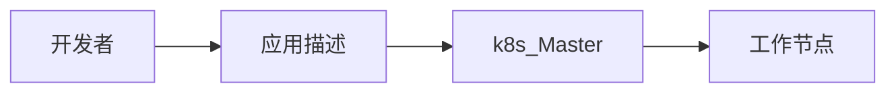
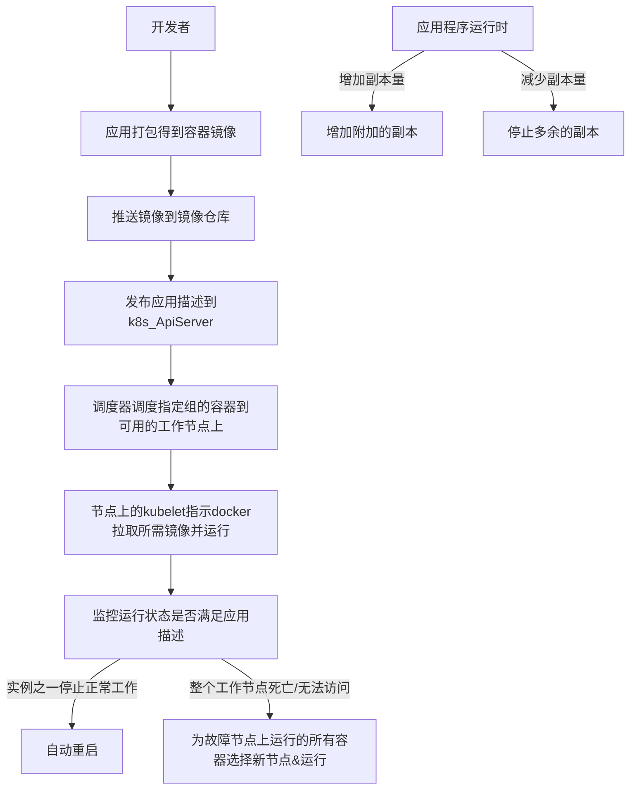

<!-- @import "[TOC]" {cmd="toc" depthFrom=1 depthTo=6 orderedList=false} -->

<!-- code_chunk_output -->

- [基础](#基础)
  - [kubernetes：](#kubernetes)
  - [特点](#特点)
  - [为什么](#为什么)
  - [能做什么](#能做什么)
- [概念](#概念)
  - [组件](#组件)
    - [1. Master组件](#1-master组件)
      - [01 kube-apiserver](#01-kube-apiserver)
      - [02 ETCD](#02-etcd)
      - [03 kube-controller-manager](#03-kube-controller-manager)
      - [04 cloud-controller-manager](#04-cloud-controller-manager)
      - [05 kube-scheduler](#05-kube-scheduler)
      - [06 addons](#06-addons)
      - [07 DNS](#07-dns)
      - [08 用户界面](#08-用户界面)
      - [09 容器资源监测](#09-容器资源监测)
      - [10 Cluster-level Logging](#10-cluster-level-logging)
    - [2. Node组件](#2-node组件)
      - [01 kubelet](#01-kubelet)
      - [02 kube-proxy](#02-kube-proxy)
      - [03 docker、rtx](#03-dockerrtx)
      - [04 supervisord](#04-supervisord)
      - [05 fluentd](#05-fluentd)
  - [运行应用的步骤](#运行应用的步骤)
      - [03 docker](#03-docker)
      - [04 supervisord](#04-supervisord)
      - [05 fluentd](#05-fluentd)

<!-- /code_chunk_output -->

# 基础
## kubernetes：
    软件系统，部署和管理容器化的应用easily。
    容器集群管理系统，可实现容器集群的自动化部署、自动化扩缩容、维护。

    快速部署、快速拓展
    无缝对接新应用功能
    节省资源、优化硬件资源的使用

    整个系统由一个主节点和若干个工作节点组成。
    开发者将一个应用列表提交到主节点，k8s将其部署到集群的工作节点。组件被部署在哪一个工作节点对开发者透明。
    开发者可以指定某些应用必须一起运行，k8s会再一个工作节点上部署它们。
## 特点
    可移植：支持公有云、私有云、混合云、多重云
    可拓展：模块化、插件化、可挂载、可组合
    自动化：自动部署、重启、复制、扩缩容
## 为什么
1. bad thing about old way：
a. 应用运行、配置、管理、生存周期将和当前OS绑定，不利于应用的升级、回滚。
b. 虚拟机较重。
2. good thing about new way:
a. 每个容器之间互相隔离，每个容器有自己的文件系统，容器之间进程不会相互影响，可区分计算资源。
b. 相比于虚拟机，容器可以快速部署；由于容器与底层设施、机器文件系统解耦，所以可以在不同云、不同操作系统版本之间迁移。

    容器资源隔离的实现：namespace、 cgroups
## 能做什么
    可以在k8s集群上运行容器化应用，k8s提供一个以“容器为中心的基础架构”，可满足：
    1. 多进程(作为容器运行)协同工作。(Pod)
    2. 存储系统挂载
    3. Distributing secrets
    4. 应用健康监测
    5. 应用实例的复制
    6. Pod自动扩缩容
    7. Naming and discovering
    8. 负载均衡
    9. 滚动更新
    10. 资源监控
    11. 日志访问
    12. 调试
    13. 认证&授权

# 概念
## 组件
### 1. Master组件
    提供集群的管理控制中心。可以在集群的任何节点上运行。
    承载着k8s控制和管理整个集群系统的控制面板。
#### 01 kube-apiserver
    用于暴露k8s-api。任何资源请求/调用操作都是通过其提供的接口进行。
#### 02 ETCD
    可靠的分布式数据存储，持久化存储集群配置
#### 03 kube-controller-manager
    运行管理控制器，是集群中处理常规任务的后台进程。
    执行集群级别的功能，如复制组件、持续跟踪工作节点、处理节点失败……
#### 01 kube-apiserver
    用于暴露k8s-api。任何资源请求/调用操作都是通过其提供的接口进行。
#### 02 ETCD
    k8s提供默认的存储系统。
#### 03 kube-controller-manager
    运行管理控制器，是集群中处理常规任务的后台进程。
    
    包括：
        节点控制器
        副本控制器：用于维护系统中每个副本中的pod
        端点控制器：填充endpoints对象（连接services和pods）
        service account&token控制器：为新的namespace创建默认账户访问api-token。
#### 04 cloud-controller-manager
    负责与底层云提供商的平台交互。
    包括：
        节点控制器
        路由控制器
        service控制器
        卷控制器
#### 05 kube-scheduler
    监视新创建没有分配到Node的Pod，为Pod选择一个Node。
#### 06 addons
    实现集群Pod和services功能。
    Pod由Deployments、ReplicationController管理。
#### 07 DNS
#### 08 用户界面
#### 09 容器资源监测
#### 10 Cluster-level Logging
### 2. Node组件
    运行在Node，提供k8s运行时环境，以及维护pod。
    运行用户实际部署的应用。
#### 01 kubelet
    主要的节点代理，监视已分配给节点的pod。
    与kube-apiserver通信，并管理它所在节点的容器。
#### 02 kube-proxy
    组件之间的负载均衡网络流量
#### 03 docker、rtx
    容器支持
#### 04 supervisord
#### 05 fluentd

## 运行应用的步骤

    描述：容器镜像、关联关系、哪些组件需要同时运行在同一个节点上和哪些组件不需要同时运行等信息。
    此外，还包括哪些组件为内部或外部客户提供服务且应该通过单个ip地址暴露，并使其他组件可以发现。
    
    关于调度：基于每组所需的计算资源，以及调度时每个节点未分配的资源。

    关于副本量：可以把决定最佳副本数目的工作交由k8s完成。
    基于实时指标，cpu负载、内存消耗、每秒查询或应用程序公开的任何其他指标自动调整副本数

    命中移动目标：容器可能由于节点失败、为其他容器的运行释放资源等原因被迁移。如果容器向运行在集群中的其他容器或者外部客户端提供服务。当容器被频繁调度时，客户端如何连接到提供服务的容器。
    实现：告知k8s哪些容器提供相同的服务，k8s将通过一个静态的ip地址暴露所有容器，将改地址暴露给客户端。kube-proxy将确保到服务的连接可跨提供服务的容器实现负载均衡。
    
    运行在Node，提供k8s运行时环境，以及维护pod
#### 01 kubelet
    主要的节点代理，监视已分配给节点的pod
#### 02 kube-proxy
#### 03 docker
#### 04 supervisord
#### 05 fluentd
