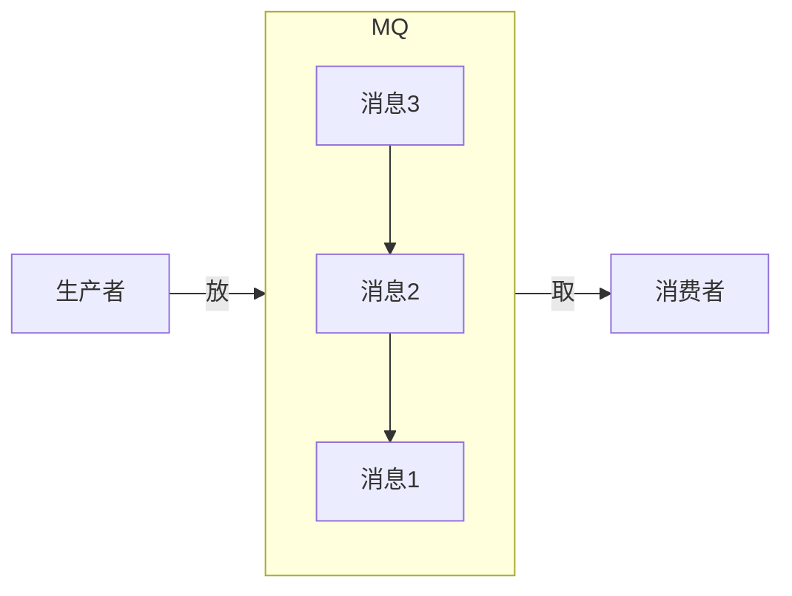
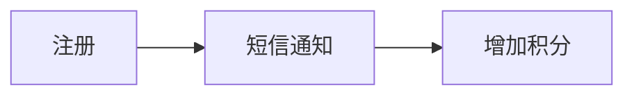
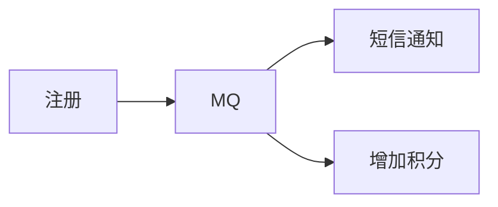
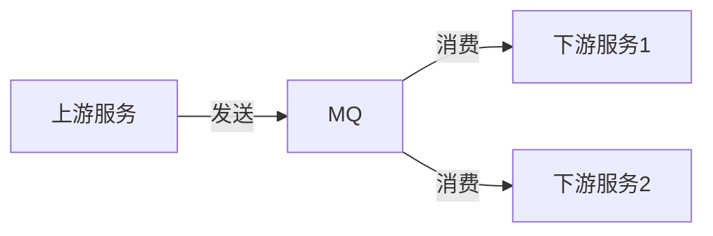
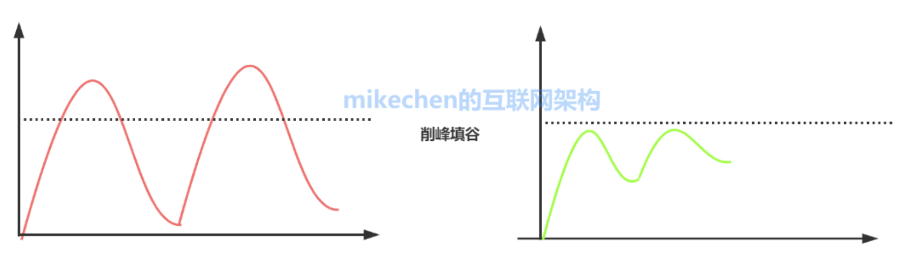
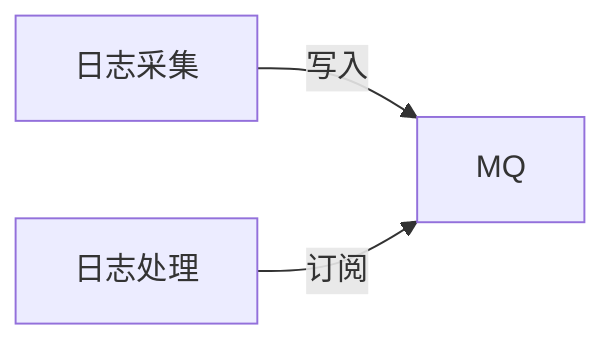
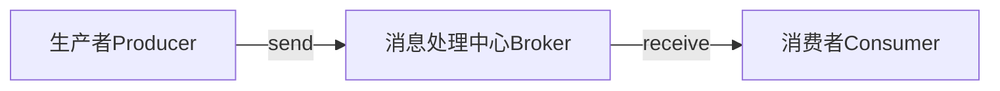
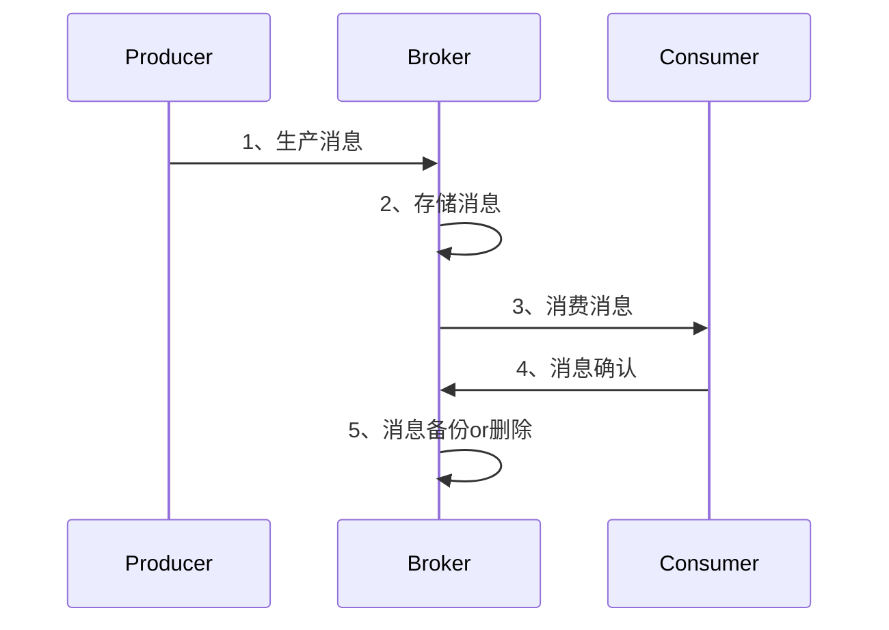
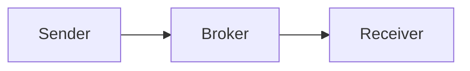
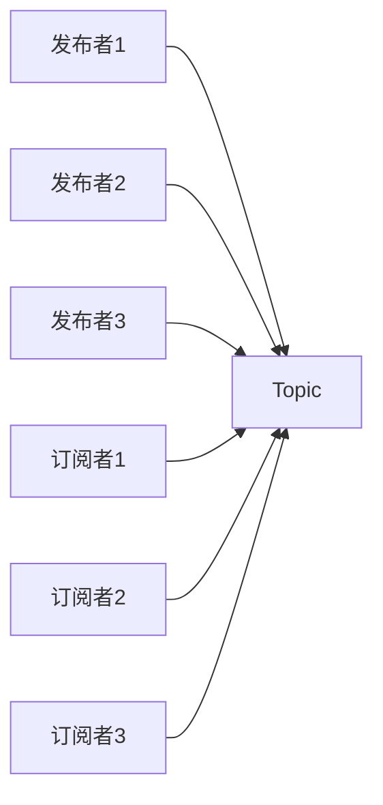

<!-- @import "[TOC]" {cmd="toc" depthFrom=1 depthTo=6 orderedList=false} -->

<!-- code_chunk_output -->

- [概述](#概述)
  - [消息队列 (Message Queue, MQ): 保存消息的容器，本质是队列。](#消息队列-message-queue-mq-保存消息的容器本质是队列)
- [应用](#应用)
  - [异步 解耦 削峰 日志](#异步-解耦-削峰-日志)
  - [1、异步](#1-异步)
  - [2、解耦](#2-解耦)
  - [3、流量削峰](#3-流量削峰)
  - [4、日志](#4-日志)
- [设计](#设计)
  - [1、整体架构](#1-整体架构)
  - [2、详细设计](#2-详细设计)
    - [1、RPC通信](#1-rpc通信)
    - [2、Broker存储](#2-broker存储)
    - [3、消费模型](#3-消费模型)
    - [4、高级特性](#4-高级特性)
- [模型](#模型)
  - [点对点](#点对点)
  - [发布订阅](#发布订阅)
- [选型](#选型)

<!-- /code_chunk_output -->

# 概述
## 消息队列 (Message Queue, MQ): 保存消息的容器，本质是队列。
    消息：进程间通信的数据。

# 应用
## 异步 解耦 削峰 日志
## 1、异步
异步的典型场景：将比较耗时且不需要即时(同步)返回结果的操作，通过消息队列实现异步化。减少请求响应时间，非核心流程异步化，提高系统响应性能。

例子：
a、同步

b、异步

## 2、解耦
只要消息格式不变，发送方&接收方不需要彼此联系，也并不受到对方影响。

## 3、流量削峰
峰值流量集中于一小段时间内，为防止系统在短时间内被峰值流量冲垮，使用消息队列来削弱峰值流量，相当于缓冲

## 4、日志

# 设计
## 1、整体架构

1. 生产者：负责产生&发送消息到Broker
2. 消息处理中心：负责消息存储、确认、重试等；一般其中包含多个Queue
3. 消费者：负责从broker中获取消息，并进行后续处理

## 2、详细设计

### 1、RPC通信
a. 成熟RPC框架; Dubbo、Thrift
b. Netty底层通信，Zookeeper、Euraka注册中心，自定义通信协议
### 2、Broker存储
a. 存储：流量削峰、最终一致性都需要Broker先存储下来，然后选择时机投递，以达到流量削峰，泄洪的目的。
    
    内存中、分布式kv存储、磁盘、数据库

### 3、消费模型
a. 单播： 点到点
b. 广播： 一点对多点
### 4、高级特性
消息确认、重复消息、顺序消息、消息延迟、事务消息
# 模型
## 点对点

**特点：**
1. 每个消息只有一个Consumer 一旦被消费，消息就不再在消息队列中
2. 发送者和接收者之间在时间上没有依赖性
3. 接受者在成功接收消息之后需向队列应答成功
   
## 发布订阅

包含三个角色：
主题：Topic
发布者：Publisher
订阅者：Subscriber
多个发布者将消息发送到Topic，系统将这些消息传递给多个订阅者
**特点：**
1. 每个消息可以有多个消费者，发布消息可以被所有订阅者消费
2. 发布者和订阅者有时间上的依赖
3. 针对某个主题的订阅者，必须创建一个订阅者后，才能消费发布者的消息
4. 为了消费消息，订阅者必须保持运行的状态
# 选型
电商、金融等对事务性要求很高的 => RocketMQ
大数据领域的实时计算、日志采集 => Kafka