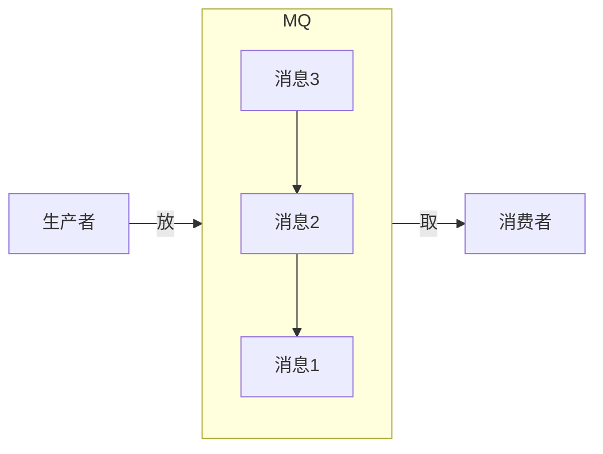
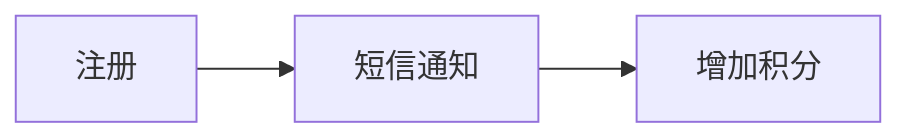
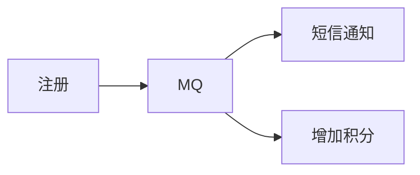
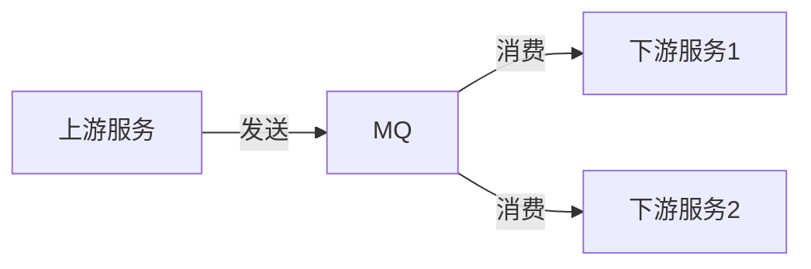
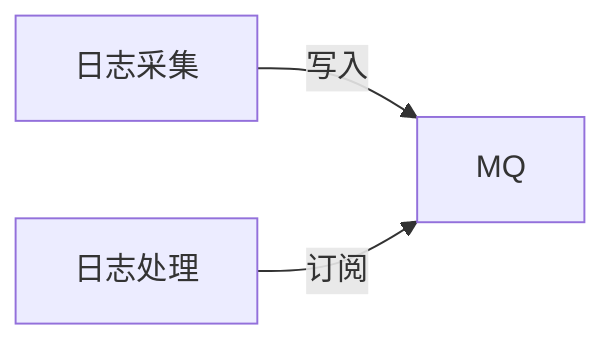
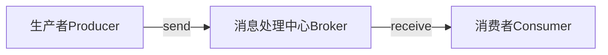
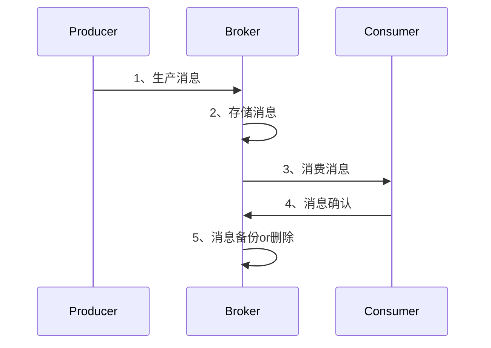

<!-- @import "[TOC]" {cmd="toc" depthFrom=1 depthTo=6 orderedList=false} -->

<!-- code_chunk_output -->

- [概述](#概述)
  - [消息队列 (Message Queue, MQ): 保存消息的容器，本质是队列。](#消息队列-message-queue-mq-保存消息的容器本质是队列)
- [应用](#应用)
  - [异步 解耦 削峰 日志](#异步-解耦-削峰-日志)
  - [1、异步](#1异步)
  - [2、解耦](#2解耦)
  - [3、流量削峰](#3流量削峰)
  - [4、日志](#4日志)
- [设计](#设计)
  - [1、整体架构](#1整体架构)
  - [2、详细设计](#2详细设计)
- [模型](#模型)
- [选型](#选型)
- [最后](#最后)

<!-- /code_chunk_output -->

# 概述
## 消息队列 (Message Queue, MQ): 保存消息的容器，本质是队列。
    消息：进程间通信的数据。

# 应用
## 异步 解耦 削峰 日志
## 1、异步
异步的典型场景：将比较耗时且不需要即时(同步)返回结果的操作，通过消息队列实现异步化。减少请求响应时间，非核心流程异步化，提高系统响应性能。

例子：
a、同步

b、异步

## 2、解耦
只要消息格式不变，发送方&接收方不需要彼此联系，也并不受到对方影响。

## 3、流量削峰
峰值流量集中于一小段时间内，为防止系统在短时间内被峰值流量冲垮，使用消息队列来削弱峰值流量，相当于缓冲

## 4、日志

# 设计
## 1、整体架构

1. 生产者：负责产生&发送消息到Broker
2. 消息处理中心：负责消息存储、确认、重试等；一般其中包含多个Queue
3. 消费者：负责从broker中获取消息，并进行后续处理

## 2、详细设计

# 模型
# 选型
# 最后