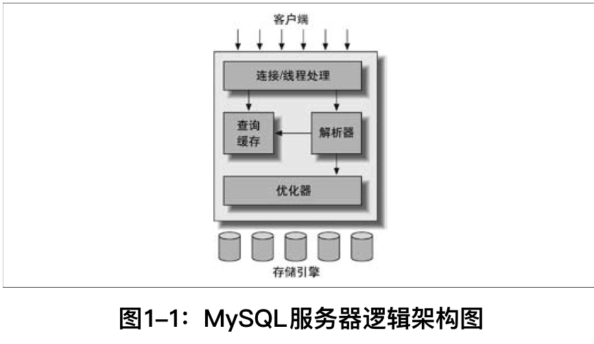

<!-- @import "[TOC]" {cmd="toc" depthFrom=1 depthTo=6 orderedList=false} -->

<!-- code_chunk_output -->

- [架构](#架构)
- [并发控制](#并发控制)
  - [锁](#锁)
    - [读写锁](#读写锁)
    - [锁粒度](#锁粒度)
    - [事务：一组原子性的SQL查询](#事务一组原子性的sql查询)
    - [ACID：](#acid)
    - [隔离级别：](#隔离级别)
    - [死锁](#死锁)
    - [事务日志](#事务日志)
    - [隐式锁定和显式锁定](#隐式锁定和显式锁定)
  - [多版本并发控制](#多版本并发控制)
- [基准测试](#基准测试)
- [性能剖析](#性能剖析)
- [schema与数据类型优化](#schema与数据类型优化)
- [索引](#索引)
- [查询性能优化](#查询性能优化)
- [高级特性](#高级特性)
- [优化服务器设置](#优化服务器设置)

<!-- /code_chunk_output -->

# 架构

    
    1、连接管理：每个客户端连接都会在服务器进程中拥有一个线程。
    这个连接的查询只会在这个单独的线程中执行，该线程只能轮流在某个CPU核心或CPU中运行。
    服务器负责缓存线程，因此不需要为每一个新建的连接创建或销毁线程。

    2、优化&执行：解析查询，创建内部数据结构(解析树)，对其进行包括重写查询、决定表的读取顺序、选择合适索引等等优化。
    优化器并不关心存储引擎，但存储引擎的不同会对性能产生影响。

    3、存储引擎负责MySQL中数据的存储和提取。服务器通过API和存储引擎进行通信，接口屏蔽了不同存储引擎之间的差异。
    存储引擎不会去解析SQL，不同引擎之间也不会互相通信，简单响应上层服务器的请求。
# 并发控制
## 锁
### 读写锁
**共享锁(shared lock)：** 读锁
    
    同一时刻多个客户可以同时读取同一个资源而互不干扰。
**排他锁(exclusive lock)：** 写锁

    一个写锁会阻塞其他的写锁和读锁以确保给定时间内只有一个用户可以执行写入，
    并防止其他用户读取正在写入的同一资源。
### 锁粒度

    一种提高共享资源并发性的方式：让锁定对象更有选择性。
    尽量只锁定需要修改的部分数据，而非所有资源。
    更理想的方式：只对会修改的数据片进行精确锁定。锁定数据量越少，系统并发程度越高。

    锁的管理也需要开销

    锁策略 => 锁的开销和数据安全性之间寻求平衡
**1. 表锁：**
**2. 行级锁：**
### 事务：一组原子性的SQL查询

    如果可以成功的对数据库应用该组查询的所有语句，就执行该组查询，如果有任何一条语句因为奔溃或其他原因无法执行，所有的语句都不会被执行。

### ACID：
1. A(atomicity):原子性
   一个事务必须被视为一个不可分割的最小工作单元，要么全部成功，要么全部失败。
2. C(consistency):一致性
    数据库总是从一个一致性的状态转换到另外一个一致性的状态。
3. I(isolation):隔离性
    通常来说(与隔离级别有关)，一个事务所做的修改在commit之前对其他事务是不可见的。
4. D(durability):持久性
    一旦事务提交，所做的修改就会永久保存到数据库中。
### 隔离级别：
1. Read Uncommitted：未提交读
    事务的修改，即使没有提交，对其他事务也都是可见的。
    事务可以读取未提交的数据 => 脏读
    不常用，性能并没有好很多，缺乏安全性
2. Read Committed：提交读
    一个事务开始时，只能看见已被提交事务所做的修改。
    => 不可重复读，因为两次执行同样的查询可能得到不同的结果
3. Repeatable Read：可重复读
    解决了脏读
    保证同一个事务多次读取同样记录的结果是一致的。
    无法解决幻读(某个事物在读取某个范围内的记录时，另外一个事务在该范围内插入了新行，产生幻行)，可通过多版本并发控制解决幻读。
    MySQL的默认事务隔离级别
4. Serializable：可串行化
    最高隔离级别，通过强制事务串行执行，避免幻读。

总结：
|隔离级别|脏读可能性   |不可重复读可能性|幻读可能性|加锁读|
|-------|-----------|-------------|---------|----|
|读未提交|  Yes      | Yes          | Yes    | No |
|读已提交|  No       | Yes          | Yes    | No |
|可重复读|  No       | No           | Yes    | No |
|串行化  |  No       | No           | No     |Yes |

设置隔离级别：SET SESSION TRANSACTION ISOLATION LEVEL READ COMMITTED;

### 死锁
两个或多个事务在同一资源上相互占用，并请求锁定对方占用的资源，导致恶性循环。

**InnoDB的处理方式：将持有最少排他锁的事务进行回滚**

### 事务日志
帮助提高事务效率。
使用事务日志，存储引擎在修改表的数据时只需要修改其内存拷贝，再把该修改行为记录到持久在磁盘上的事务日志中，而不用每次都将修改的数据本身持久到磁盘。
事务日志采用追加方式，写日志操作是磁盘上一小块区域内的顺序I/O, 而不像随机I/O需要在磁盘的多个地方移动刺头。相对更快。
之后后台慢慢刷回到磁盘。
WAL(Write Ahead Logging): 预写日志
### 隐式锁定和显式锁定
InnoDB采用两阶段锁定协议(two-phase locking protocol)
在事务执行过程中随时都可以锁定，锁只有在commit 或者 rollback的时候才会释放，并且所有的锁同时被释放。InnoDB会根据隔离级别在需要的时候自动加锁。
## 多版本并发控制
# 基准测试
# 性能剖析
# schema与数据类型优化
# 索引
# 查询性能优化
# 高级特性
# 优化服务器设置
